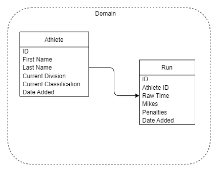
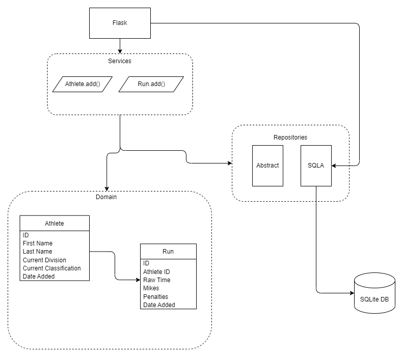

# Final Project Information and Write Up

**Robert Stockwell**  
West Texas A&M University  
CIDM 6330 Spring 2022  
May 1st, 2022  

## Background and Problem Statement

This idea came from a discussion during an advanced movement training class with Coach Kita Busse with 180 Firearms Training. The class ended up being more of a how-to train yourself by setting goals and tracking progress on attaining those goals. Improving this requires deliberate practice and following specific goals that should be followed and recorded to track and view progress. There are many types of shooting sports out there, and training and proficiency allow shooting competitors to improve against themselves and other fellow competitors. The three main shooting sports in the United States are the United States Practical Shooting Association, USPSA, Steel Challenge Shooting Association, and International Defensive Pistol Association, IPDA. 

A quick primer on the three shooting sports. When talking with people in the general public that are not familiar with shooting sports, the individual sports get compared to auto racing types. USPSA is compared with Open Wheeled Indy Racing, with lots of movement, and try and go as fast as you can without crashing. Steel Challenge is the funny car drag racing of the competitive shooting world. The same eight short courses of fire as fast as you can. IDPA is considered the NASCAR of the shooting world. Course layouts that everyone pretty much follows, there are some movement changes but not many, with equipment that is pretty close in specifications. 

USPSA is the largest and probably the most active of the sports and has the highest associated cost with participating. Steel Challenge will be the easiest and cheapest to get involved with. The rimfire division in Steel Challenge allows an individual to go to a match and participate with a gun and relatively inexpensive ammunition, not requiring the belts and magazine carriers like USPAS and IDPA.  

To track a shooter’s performance against either themselves or other shooters, there needs to be a way to track and compare. To start this, shooters are broken into the same skill level with the division and classification they are participating in. The rest is followed by the total time of a course of fire. Total time is a summation of the raw time, misses, and other penalties, such as procedural errors. 

## Program Setup and Information

The following are my notes on what I am doing for the setup of the application and development. Needing to track the intentional practice required to improve in these sports, or any sports or other endeavors, I am looking at monitoring the shooter (athlete), goal, and actionable steps to reach the stated goal. 

After talking with Dr. Babb, the application was changed to track the athlete and runs. This simplifies the project and should allow me to get through chapter 6. Additional information on the "runs" has been provided below. Notes added to the Goal and Steps information below as well. 

### Athlete

For this project, the information on the athlete that will be stored in the database is the shooter’s name, current classification, and current division. These are just what is currently being trained in. A shooter in the United States Practical Shooting Association, USPSA, and Steel Challenge Shooting Association, SCSA, can hold a classification in any division at one time, as most do. The current breakdown of the USPSA divisions includes:

1. Open (Open)
2. Limited (Lim)
3. Production (Prod)
4. Single Stack (SS)
5. Revolver (REV)
6. Carry Optics (CO)
7. Pistol Caliber Carbine (PCC)

    Steel Challenge has additional divisions below.

8. Rimfire Pistol Iron Sights (RFPI)
9. Rimfire Pistol Optics (RFPO)
10. Rimfire Rifle Iron Sights (RFRI)
11. Rimfire Rifle Optics (RFRO)
13. Revolver Optics (REVO)
14. Pistol Caliber Carbine Iron (PCCI)


The shortened nomenclature will be used for storing the information in the database; Production will be Prod, Carry Optics will be CO, etc. 

The classifications are broken down into Grand Master, Master, A, B, C, D, Novice, and Unclassified. To determine the shooter’s classification, they are placed into a percentage bracket. The shooter’s "percentage is based on your scores as they relate to the average high scores on file for a particular course of fire. To receive an initial classification, a member needs to have at least four unduplicated scores in the USPSA classification database. If there are more than four scores on file, the best four scores of the most recent six scores will be used. Scores are sorted according to the match date to determine which scores are the most recent. For matches that are Level I Specials, the scores are further sorted by the score percent in descending order. In doing so, the lowest scores from a special will be the first scores to drop out of the most recent scores on file. After a member has earned a classification, the classification system will look at the best six unduplicated scores of the most recent eight to evaluate the member’s current classification percentage." (USPSA / IPSC, Inc., 2021) Standard identifiers will be used in the database; please see the table below. 

| Classification | Short Id |                          Percentage |
| :------------- | :------: | ----------------------------------: |
| Grand Master   |    GM    |                           95 - 100% |
| Master         |    M     |                          85 - 94.9% |
| A Class        |    A     |                          75 - 84.9% |
| B Class        |    B     |                          60 - 74.9% |
| C Class        |    C     |                          40 - 59.9% |
| D Class        |    D     |                           Below 40% |
| Unclassified   |    U     | Not enough classifiers to calculate |

### Runs

After reviewing where I am at with Dr. Babb, the suggestion to change my approach was made. To simplify what I am doing. Instead of the goals and steps that I initially considered, a table of runs should be the additional information that the system is working with. A tally can be pulled for the shooter (athlete) and look at performance based on the total time. Thinking of this from a Steel Challenge point of view, it would be like having a match for one stage. 

The "Runs" are the stage runs recorded for the athlete. The table will be recording the athlete_id, along with the run information. This information will include the "Total time,” any "mikes,” the shooting nomenclature for misses, and additional penalties. 

### Goals

Goals information was removed after the change to the project setup. All info was commented out of the application instead of deleted. This way, it can be reviewed and acted upon later.

### Steps

Steps are the action items that a shooter is planning on taking to improve an identified goal. 

After the project was updated, the information and code for the steps were commented out. As much as was there, it is being left intact to be reviewed and fleshed out later. 

## Models

### Domain

Using the above information of the problem set, the domain model ends up like this.



### Services



### Unit of Work

## Project Validation and Justification

### My skill level

So as I have been working on this project, it has quickly become apparent that I need to increase my Python skill level. I am having difficulty following along and understanding the code and what is happening. When rereading the preface in the "Who Should Read This Book," the first thing they assume about the reader.

> * You've been close to some reasonably complex Python applications.
> * You've seen some of the pain that comes with trying to manage that complexity
> * You don't necessarily know anything about DDD or any of the classic application architecture patterns. (Gregory, 2020)

After working through this project, I do not meet the first criteria. Over the summer, I will be working on correcting that. I do not know if this pertains to the project; I feel it needs to be stated, so there is a goal. Now to start setting actionable steps. 

### Pytest

As we are doing this project, I am taking several insights from pytest. I do like the way it operates, and the flexibility is excellent. Being able to target a specific test for execution is nice. With the change in the project, I needed to be able to test the 'Run' repository test quickly, and the ability to target it made that happen. I was able to find an issue with the data types were not compatible. 

### SQLite

#### Date Time Data Type Issues
I ran into several date format issues along the way. Not being able to create a correct string with the "stroftime" function, I modified the database set up to allow date fields to be nullable. I have added "None" in several locations as the insert value. I have added a string for the day I worked on the code in several cases. This string follows the format of "YYYY-mm-dd" and satisfies the requirements for the testing. 

I've had issues with the date and DateTime data types with SQLite. During the addition of the "Run.add()" test, I supplied the value of '2022-05-01' for the add_date record. For some reason, when the test was run, this was kicked out from pytest with the following message:

```python
raise TypeError(
                "SQLite Date type only accepts Python "
                "date objects as input."
            )
            sqlalchemy.exc.StatementError: (builtins.TypeError) SQLite Date type only accepts Python date objects as input.
E           [SQL: INSERT INTO runs (athlete_id, raw_time, mikes, penalties, add_date) VALUES (?, ?, ?, ?, ?)]
E           [parameters: [{'penalties': 2, 'add_date': '2022-05-01', 'athlete_id': 1, 'mikes': 0, 'raw_time': 38.42}]]
```

Having set up the 'add_date' values to be able to be null in the database, changing the value to 'None' corrected the issue, and the test passed.

While following along with the book, I had created a variable 'today' from function 'date.today()'. On a whim, I tried using this again as the input, it worked, and both the 'test_repository_can_add_athlete' and 'test_repository_can_add_run' test worked. I do not know what I was doing wrong before. 

### Testing

#### Repository.py

One issue that I ran into was getting the mapping tests in 'orm_test.py' to return the correct values. I suspect this has to do with inserting a row of data in the 'test_repository.py' file. According to the book, this can be considered a throwaway test, so I was not highly concerned about making this test work. Having the tests in 'test_repository.py' pass, I feel this is not a worthwhile endeavor to spend time on.

Testing failure in the "test_repository_can_add_athlete" was a central sticking point. After looking over this with Dr. Babb, I was able to move forward. The "response=response" inside SqlAlchemyRepository class was the main issue with the code block:

Original:
```python
    def get(self, athlete):
        return self.session.query(app.Athlete).filter_by(reference=reference).one()
```
This was an area when I was following along with the book; I was confused. The "reference=reference" did not make sense to me. After working through it with Dr. Babb, this is what the code block was changed to:

Change:
```python
    def get(self, athlete):
        return self.session.query(app.Athlete).filter_by(athlete_id=athlete.athlete_id).one()
```

The change allowed the reference to the "athlete" object to be passed into the SqlAlchemyRepository class and be able to search the SQLite database with the "athlete_id" and return the correct one. Also, during this review, the test itself was updated. Part of the error returned from the "pytest" command was that the returned objects did not match types. This occurred when I followed along with the book and inserted a SQL statement to return the item from the "athletes" table in SQLite. The command returned all of the records stored in the database. Every time I ran the test, the command executed and inserted another row. This causes the test to fail. After looking at this, two changes were made. The "athlete_id" was initially manually added to the insert. This was done since the auto-increment recall piece seemed to be some oddness. The "assert" statement was also adjusted by removing the SQL statement and searching for the newly added athlete record using the "get" method of the class. Changes are noted below:

Original:
```python
    rows = session.execute(
            'SELECT first_name, last_name, current_division, current_classification, add_date FROM "athletes"'
    )
    print(list(rows))
    assert list(rows) == [("Onename", "lastName", "SS", "GM", None)]
```

Change:
```python
    athlete2 = repo.get(athlete)
    assert athlete == athlete2
```

#### Services.py

I have ended up in a logic circle that I can't seem to break out of. Receiving this error when trying to run the add function at the services level. The repository and repository test are working fine. The missing "repo" and "session" are then added to the test. The lower error is returned when those are added. I am again running into my lack of knowledge of a more complex Python project.

```python
def test_add_athlete(session):
        test_athlete = app.Athlete("robert", "lathem", "SS", "GM", today)
        # repo = FakeRepository([athlete])
        # repo = repository.SqlAlchemyRepository(test_athlete)
        repo = repository.SqlAlchemyRepository([test_athlete])
>       result = services.add_athlete(test_athlete)
E       TypeError: add_athlete() missing 2 required positional arguments: 'repo' and 'session'
```
After a computer shutdown and restart this is not the same error being returned. This might be progress. 
```python
self = <repository.SqlAlchemyRepository object at 0x000002BDD380D3D0>, athlete = <app.Athlete object at 0x000002BDD380D190>

    def add(self, athlete):
>       self.session.add(athlete)
E       AttributeError: 'list' object has no attribute 'add'

repository.py:24: AttributeError
```
## References

Gregory, H.J. (2020). *Architecture Patterns with Python.* Sebastopol: O’Reilly Media, Inc.

USPAS/IPSC, Inc. (2021). *USPAS Competition Rules.* Burlington: USPAS/IPSC. Inc.
