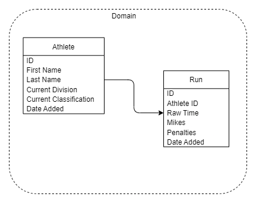

# CIDM 6330 Spring 2022 Final Project - Shooters Log

## Problem Statement

To track a shooter’s performance against either themselves or other shooters, there needs to be a way to track and compare. To start this, shooters are broken into the same skill level with the division and classification they are participating in. The rest is followed by the total time of a course of fire. Total time is a summation of the raw time, misses, and other penalties, such as procedural errors. 

## Milestone 1

This is following along with the code from "Architecture Patters with Python" book. 

The goal of this project is to start building a shooters log for tracking performance and long term goals. This will currently be targeted toward the sport of United States Practical Shooting Association style of competition. 

## Project refactor

After looking at the project with Dr. Babb, the scope of the project is changing. To simplify the project the goals and steps will be removed. Code will be commented out for possible future use. A runs object will be added to the project to track information on individual runs for the shooter, the athlete class. This should help simplify the project and the tests that need to be written for completion. The Domain model will need to be updated and added to this document for reference. 

## Updated Domain Model

Having made the changes noted above the domain model needed to be updated. 

